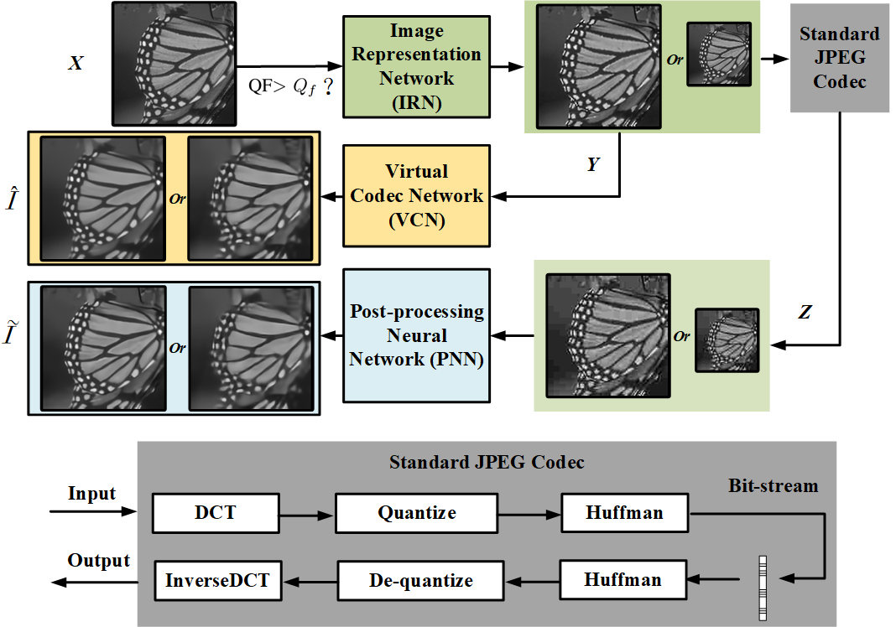
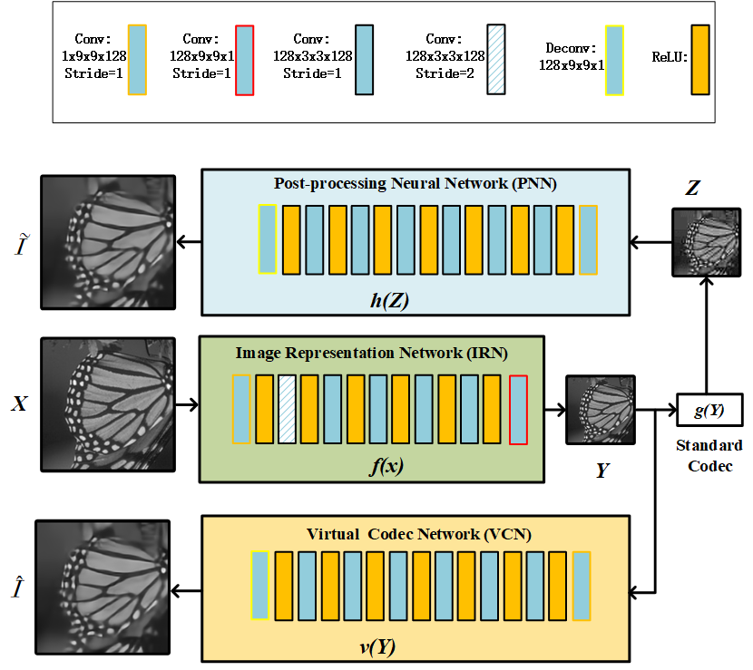
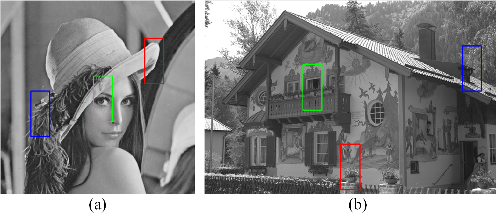
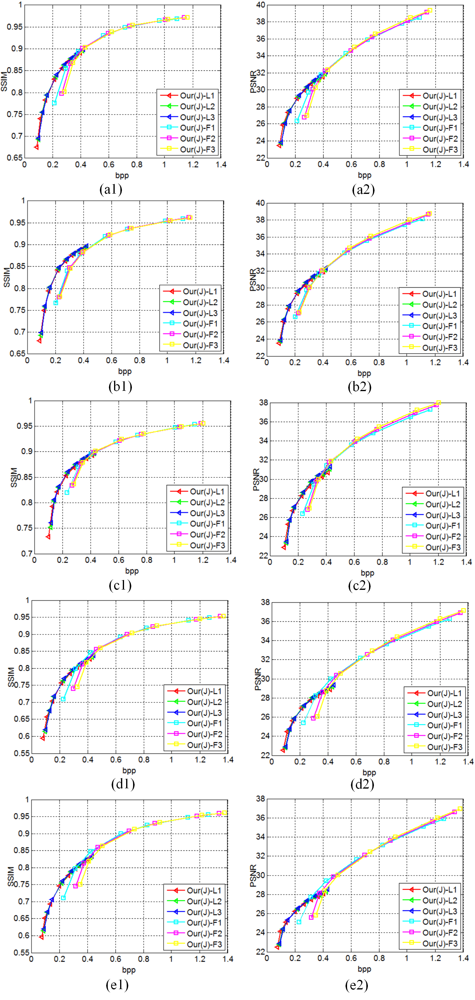
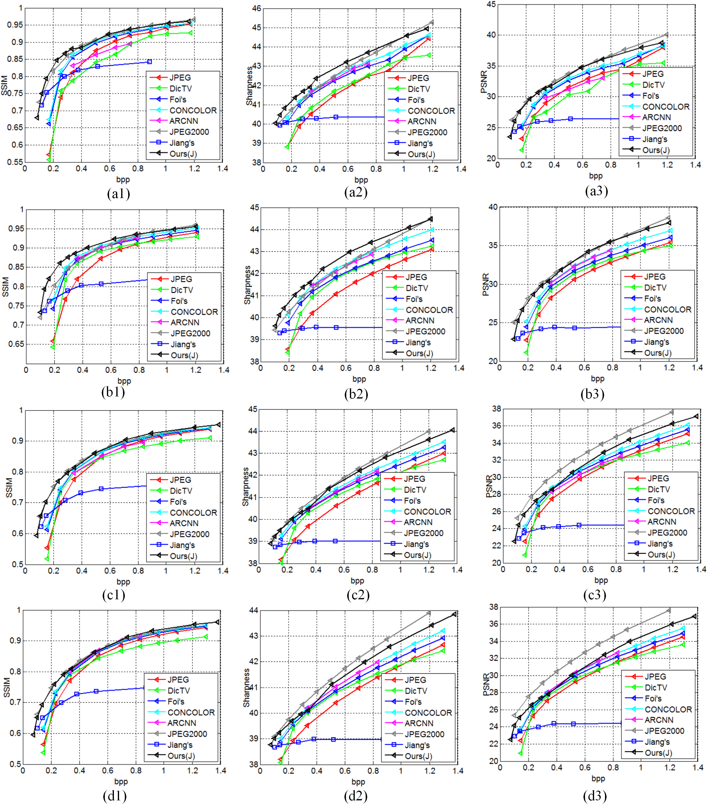
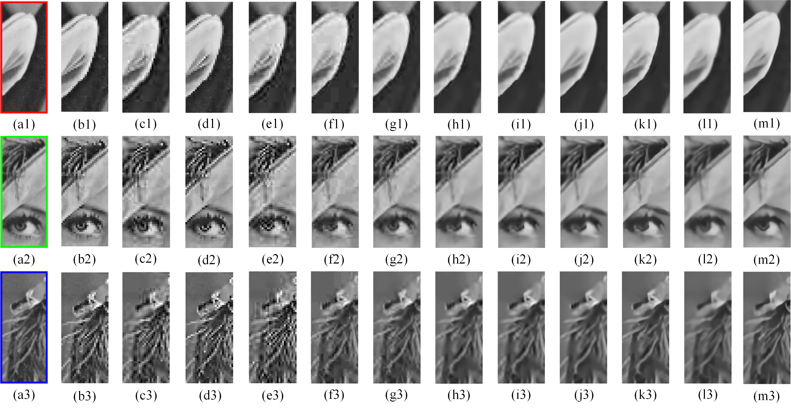
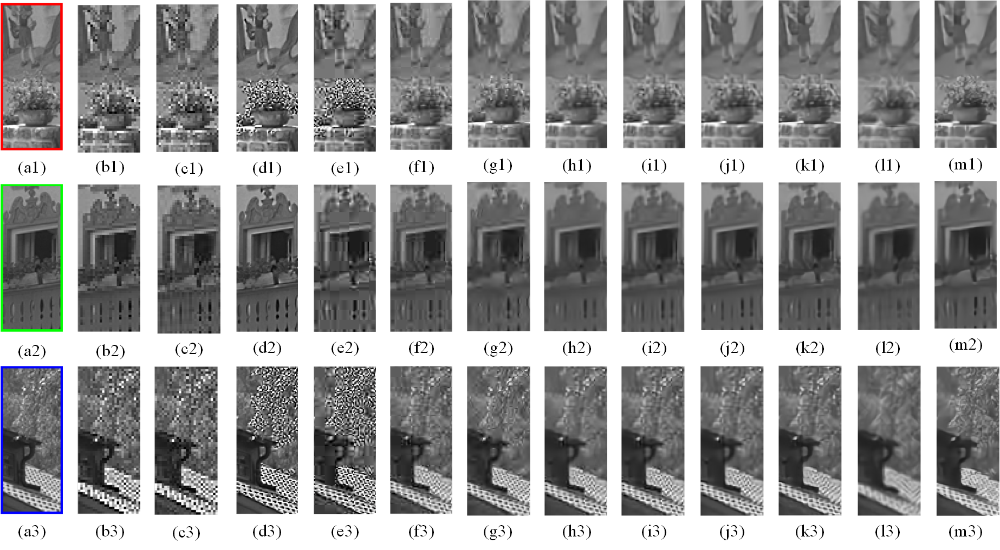

## Learning a Virtual Codec Based on Deep Convolutional Neural Network to Compress Image

### The figures for paper "Learning a Virtual Codec Based on Deep Convolutional Neural Network to Compress Image"

### Fig. 1 

  
  
  
### Fig. 2

  
  
 
### Fig. 3 

  
  
  
### Fig. 4 

  
  
 
### Fig. 5 

  
  
  
  ### Fig. 6 

  
  
  
  ### Fig. 7 

  
  
